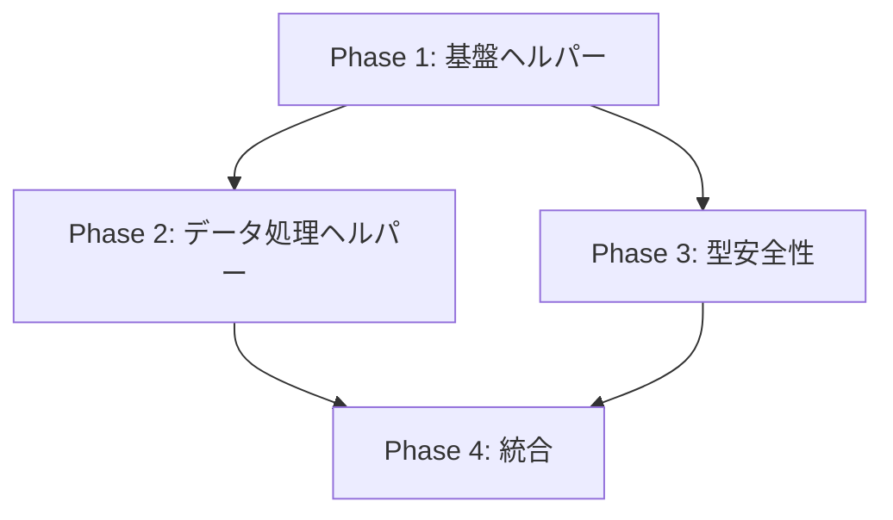

# コード品質改善実装計画書（Phase/Step版）

作成日: 2025年9月11日
目標: B+評価 → A+評価達成
削減目標: 1,200行のコード重複削除 + any型125件削減

## エグゼクティブサマリー

本計画は論理的なPhase/Step構造により、段階的かつ確実にコード品質をA+レベルに引き上げます。各Phaseは独立して実装・テスト可能で、リスクを最小限に抑えながら最大の効果を実現します。

## 全体構成

```
Phase 1: 基盤ヘルパークラス実装（最優先）
├── Step 1.1: ErrorHandler実装
├── Step 1.2: 既存エラー処理の置き換え
└── Step 1.3: DOMBuilder実装と適用

Phase 2: データ処理ヘルパー実装
├── Step 2.1: DateHelper実装
├── Step 2.2: StorageHelper実装
└── Step 2.3: ValidationHelper実装

Phase 3: 型安全性改善
├── Step 3.1: 型定義ファイル作成
├── Step 3.2: 重要モジュールのany型削減
└── Step 3.3: 全体的な型安全性向上

Phase 4: 統合と最適化
├── Step 4.1: 統合テスト
├── Step 4.2: パフォーマンス測定
└── Step 4.3: ドキュメント更新
```

## Phase 1: 基盤ヘルパークラス実装

### 概要
最も影響が大きく、即座に効果が出る2つの基盤ヘルパーを実装します。

**削減効果**: 650行（全体の6.5%）
**リスク**: 低
**優先度**: ★★★★★

### Step 1.1: ErrorHandler実装

#### 目的
136箇所に散在するエラーハンドリングを統一化

#### 実装内容
```typescript
// src/ui/shared/utils/ErrorHandler.ts
export interface ErrorOptions {
  showAlert?: boolean;
  fallback?: any;
  rethrow?: boolean;
  logLevel?: 'error' | 'warn' | 'info';
}

export class ErrorHandler {
  private static errorCounts = new Map<string, number>();
  
  /**
   * 汎用エラーハンドリング
   */
  static handle(error: unknown, context: string, options: ErrorOptions = {}): any {
    const {
      showAlert = false,
      fallback = undefined,
      rethrow = false,
      logLevel = 'error'
    } = options;
    
    const message = this.formatError(error);
    const fullMessage = `[${context}] ${message}`;
    
    // エラー頻度の記録
    this.recordError(context);
    
    // ログ出力
    console[logLevel](fullMessage, error);
    
    // アラート表示
    if (showAlert) {
      alert(`エラーが発生しました: ${message}`);
    }
    
    // 再スロー
    if (rethrow) {
      throw error;
    }
    
    return fallback;
  }
  
  /**
   * 非同期処理のエラーハンドリング
   */
  static async handleAsync<T>(
    fn: () => Promise<T>,
    context: string,
    fallback?: T
  ): Promise<T | undefined> {
    try {
      return await fn();
    } catch (error) {
      return this.handle(error, context, { fallback });
    }
  }
  
  /**
   * リトライ機能付きエラーハンドリング
   */
  static async withRetry<T>(
    fn: () => Promise<T>,
    context: string,
    options: { maxRetries?: number; delay?: number; backoff?: boolean } = {}
  ): Promise<T> {
    const { maxRetries = 3, delay = 1000, backoff = true } = options;
    
    let lastError: unknown;
    
    for (let attempt = 1; attempt <= maxRetries; attempt++) {
      try {
        return await fn();
      } catch (error) {
        lastError = error;
        console.warn(`[${context}] Attempt ${attempt}/${maxRetries} failed:`, error);
        
        if (attempt < maxRetries) {
          const waitTime = backoff ? delay * attempt : delay;
          await new Promise(resolve => setTimeout(resolve, waitTime));
        }
      }
    }
    
    throw lastError;
  }
  
  /**
   * JSONパース専用エラーハンドリング
   */
  static parseJSON<T>(json: string, fallback: T): T {
    try {
      return JSON.parse(json);
    } catch {
      return fallback;
    }
  }
  
  private static formatError(error: unknown): string {
    if (error instanceof Error) {
      return error.message;
    }
    if (typeof error === 'string') {
      return error;
    }
    return 'Unknown error occurred';
  }
  
  private static recordError(context: string): void {
    const count = this.errorCounts.get(context) || 0;
    this.errorCounts.set(context, count + 1);
  }
}
```

#### 成功基準
- [ ] ファイル作成完了
- [ ] ビルドエラーなし
- [ ] 基本的なエラーハンドリングが動作

### Step 1.2: 既存エラー処理の置き換え

#### 対象パターンと置き換え方法

##### パターンA: 基本的なエラーログ（60箇所）
```typescript
// Before
try {
  // 処理
} catch (error) {
  console.error('[ComponentName] Error:', error);
}

// After
try {
  // 処理
} catch (error) {
  ErrorHandler.handle(error, 'ComponentName');
}
```

##### パターンB: フォールバック処理（40箇所）
```typescript
// Before
try {
  return JSON.parse(data);
} catch {
  return defaultValue;
}

// After
return ErrorHandler.parseJSON(data, defaultValue);
```

##### パターンC: 非同期エラー処理（30箇所）
```typescript
// Before
try {
  await someAsyncOperation();
} catch (error) {
  console.error('Operation failed:', error);
  throw error;
}

// After
await ErrorHandler.handleAsync(
  () => someAsyncOperation(),
  'Operation',
  { rethrow: true }
);
```

#### 置き換え対象ファイル（優先順位順）
1. ApplicationFacade.ts（15箇所）
2. UnifiedDataStore.ts（12箇所）
3. ProgressTable.ts（10箇所）
4. BaseService.ts（8箇所）
5. その他のファイル（91箇所）

#### 成功基準
- [ ] 主要ファイルの置き換え完了
- [ ] ビルド成功
- [ ] 既存機能の動作確認

### Step 1.3: DOMBuilder実装と適用

#### 目的
314箇所のDOM操作パターンを統一化

#### 実装内容
```typescript
// src/ui/shared/utils/DOMBuilder.ts
export interface ElementOptions {
  className?: string | string[];
  textContent?: string;
  innerHTML?: string;
  attributes?: Record<string, string>;
  data?: Record<string, string>;
  styles?: Partial<CSSStyleDeclaration>;
  children?: (HTMLElement | string)[];
  events?: Record<string, EventListener>;
}

export class DOMBuilder {
  /**
   * 要素を作成（最も使用頻度が高い）
   */
  static create<K extends keyof HTMLElementTagNameMap>(
    tag: K,
    options: ElementOptions = {}
  ): HTMLElementTagNameMap[K] {
    const element = document.createElement(tag);
    
    // クラス設定
    if (options.className) {
      const classes = Array.isArray(options.className) 
        ? options.className 
        : [options.className];
      element.className = classes.filter(Boolean).join(' ');
    }
    
    // テキスト/HTML設定
    if (options.textContent !== undefined) {
      element.textContent = options.textContent;
    } else if (options.innerHTML !== undefined) {
      element.innerHTML = options.innerHTML;
    }
    
    // 属性設定
    if (options.attributes) {
      Object.entries(options.attributes).forEach(([key, value]) => {
        element.setAttribute(key, value);
      });
    }
    
    // データ属性設定
    if (options.data) {
      Object.entries(options.data).forEach(([key, value]) => {
        element.dataset[key] = value;
      });
    }
    
    // 子要素追加
    if (options.children) {
      options.children.forEach(child => {
        if (typeof child === 'string') {
          element.appendChild(document.createTextNode(child));
        } else {
          element.appendChild(child);
        }
      });
    }
    
    // イベント設定
    if (options.events) {
      Object.entries(options.events).forEach(([event, handler]) => {
        element.addEventListener(event, handler);
      });
    }
    
    return element;
  }
  
  /**
   * 条件付きクラス操作
   */
  static toggleClass(
    element: HTMLElement,
    className: string,
    condition?: boolean
  ): void {
    element.classList.toggle(className, condition);
  }
  
  /**
   * テーブルセル作成（プロジェクト特有）
   */
  static createTableCell(
    content: string,
    options: ElementOptions & {
      row?: number;
      column?: string;
      cutId?: string;
    } = {}
  ): HTMLTableCellElement {
    const { row, column, cutId, ...elementOptions } = options;
    
    return this.create('td', {
      ...elementOptions,
      textContent: content,
      data: {
        ...(row !== undefined && { row: row.toString() }),
        ...(column && { column }),
        ...(cutId && { cutId })
      }
    });
  }
}
```

#### 置き換え対象
1. createElement('div')（78箇所）
2. classList操作（56箇所）
3. innerHTML設定（16箇所）
4. その他のDOM操作（164箇所）

#### 成功基準
- [ ] DOMBuilder実装完了
- [ ] 主要なDOM操作の置き換え
- [ ] UIの表示が正常

## Phase 2: データ処理ヘルパー実装

### 概要
データ処理に関する重複を解消する3つのヘルパーを実装

**削減効果**: 450行（全体の4.5%）
**リスク**: 低
**優先度**: ★★★★☆

### Step 2.1: DateHelper実装

#### 目的
5箇所以上に散在する日付処理を統一

#### 実装のポイント
- formatDate()の統一実装
- 日付バリデーション
- 営業日計算
- ISO形式変換

#### 置き換え対象ファイル
1. NormaDataService.ts
2. CalendarPopup.ts
3. FieldFormatter.ts
4. TableUtils.ts
5. SimulationView.ts

### Step 2.2: StorageHelper実装

#### 目的
75箇所のlocalStorage操作を統一化

#### 実装のポイント
- TTL（有効期限）付き保存
- 安全なJSON parse/stringify
- プレフィックス管理
- バッチ操作

#### 主要機能
- save/load（基本操作）
- saveMany/loadMany（バッチ操作）
- migrate（データ移行）
- cleanup（期限切れデータ削除）

### Step 2.3: ValidationHelper実装

#### 目的
100箇所以上のデータ検証処理を統一

#### 実装のポイント
- null/undefined/空文字チェック
- 型検証（日付、数値、配列、オブジェクト）
- デフォルト値保証
- プロジェクト特有の検証（カット番号等）

## Phase 3: 型安全性改善

### 概要
any型を155件から30件以下に削減

**削減効果**: any型125件削減
**リスク**: 中
**優先度**: ★★★★★（A+評価に必須）

### Step 3.1: 型定義ファイル作成

#### 作成するファイル

##### logger.types.ts
```typescript
export type LogLevel = 'debug' | 'info' | 'warn' | 'error';
export interface LogEntry {
  level: LogLevel;
  message: string;
  timestamp: Date;
  data?: unknown;
  context?: string;
}
```

##### service.types.ts
```typescript
export interface ServiceConfig {
  name: string;
  version: string;
  dependencies: string[];
}

export interface ServiceResponse<T = unknown> {
  success: boolean;
  data?: T;
  error?: Error;
}
```

##### event.types.ts
```typescript
export interface EventPayload {
  type: string;
  data: Record<string, unknown>;
  metadata: EventMetadata;
}

export interface EventMetadata {
  timestamp: number;
  userId?: string;
  correlationId: string;
}
```

### Step 3.2: 重要モジュールのany型削減

#### 優先順位と対象

| ファイル | any型数 | 優先度 | 理由 |
|----------|---------|--------|------|
| Logger.ts | 17 | 極高 | 全体で使用 |
| BaseService.ts | 11 | 極高 | 基底クラス |
| UnifiedStateManager.ts | 9 | 高 | 状態管理の中核 |
| SimplifiedReadModel.ts | 7 | 高 | データアクセス |
| KintoneApiClient.ts | 7 | 中 | API通信 |
| UnifiedEventCoordinator.ts | 6 | 中 | イベント管理 |

### Step 3.3: 全体的な型安全性向上

#### 実施内容
1. unknownへの置き換え（any → unknown）
2. ジェネリクスの活用
3. 型ガードの実装
4. 型アサーションの最小化

## Phase 4: 統合と最適化

### 概要
実装したヘルパーの統合テストと最適化

**リスク**: 低
**優先度**: ★★★☆☆

### Step 4.1: 統合テスト

#### テスト項目
- [ ] ビルド成功
- [ ] 既存機能の動作確認
- [ ] パフォーマンス劣化なし
- [ ] エラーハンドリングの一貫性

### Step 4.2: パフォーマンス測定

#### 測定項目
- ビルド時間
- バンドルサイズ
- 初期表示速度
- メモリ使用量

### Step 4.3: ドキュメント更新

#### 更新対象
- README.md（ヘルパークラスの使用方法）
- アーキテクチャドキュメント
- 開発ガイドライン

## 実装順序と依存関係



### 推奨実装順序

1. **最優先**: Phase 1（基盤ヘルパー）
   - 即座に大きな効果
   - 他のPhaseの基盤となる

2. **次優先**: Phase 3（型安全性）
   - A+評価に必須
   - 並行実装可能

3. **その後**: Phase 2（データ処理ヘルパー）
   - 追加の改善効果
   - Phase 1完了後に実装

4. **最後**: Phase 4（統合）
   - 全Phase完了後に実施

## リスク管理マトリクス

| Phase | リスクレベル | 影響範囲 | 緩和策 |
|-------|-------------|----------|--------|
| Phase 1 | 低 | 全体 | 段階的置き換え |
| Phase 2 | 低 | 部分的 | 機能単位でテスト |
| Phase 3 | 中 | 全体 | 型アサーション使用 |
| Phase 4 | 極低 | なし | - |

## 成功指標

### Phase完了基準

#### Phase 1完了
- [ ] ErrorHandler: 136箇所の置き換え
- [ ] DOMBuilder: 主要DOM操作の統一
- [ ] 削減行数: 650行以上
- [ ] ビルドエラー: 0件

#### Phase 2完了
- [ ] 3つのヘルパー実装
- [ ] 削減行数: 450行以上
- [ ] 既存機能の動作確認

#### Phase 3完了
- [ ] any型: 30件以下
- [ ] 型カバレッジ: 95%以上
- [ ] TypeScriptエラー: 0件

#### Phase 4完了
- [ ] 統合テスト: 全パス
- [ ] パフォーマンス: 劣化なし
- [ ] ドキュメント: 最新化

### 最終目標達成基準

| 指標 | 現状 | 目標 | 達成基準 |
|------|------|------|----------|
| コード重複 | 1,200行 | 0行 | Phase 1-2完了 |
| any型 | 155件 | 30件以下 | Phase 3完了 |
| 総合評価 | B+ | A+ | 全Phase完了 |

## コマンドリファレンス

```bash
# Phase 1検証
grep -r "try {" src/ --include="*.ts" | wc -l  # エラーハンドリング数
grep -r "createElement" src/ --include="*.ts" | wc -l  # DOM操作数

# Phase 2検証
grep -r "localStorage" src/ --include="*.ts" | wc -l  # ストレージ操作数
grep -r "new Date" src/ --include="*.ts" | wc -l  # 日付処理数

# Phase 3検証
grep -r ": any\|as any" src/ --include="*.ts" | wc -l  # any型数
npx tsc --noEmit  # 型チェック

# Phase 4検証
npm run build:test  # ビルド確認
npm test  # テスト実行
```

## 結論

このPhase/Step構造により、論理的かつ段階的にコード品質をA+レベルに引き上げることが可能です。各Phaseは独立して実装・検証可能で、リスクを最小限に抑えながら確実に目標を達成できます。

最優先はPhase 1の実装で、これだけでも650行のコード削減と大幅な品質向上が実現できます。