# アーキテクチャ図表集
作成日: 2025年9月16日

## 1. 全体アーキテクチャ図

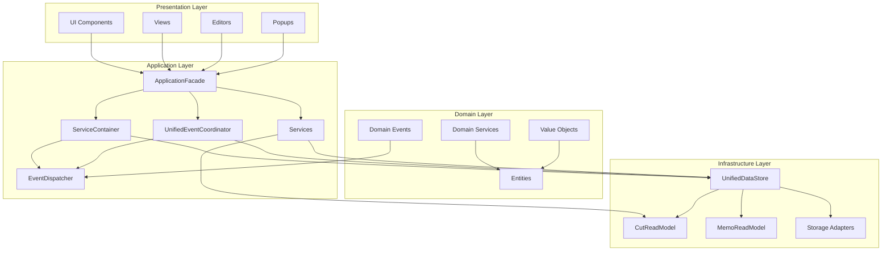

## 2. データフロー図

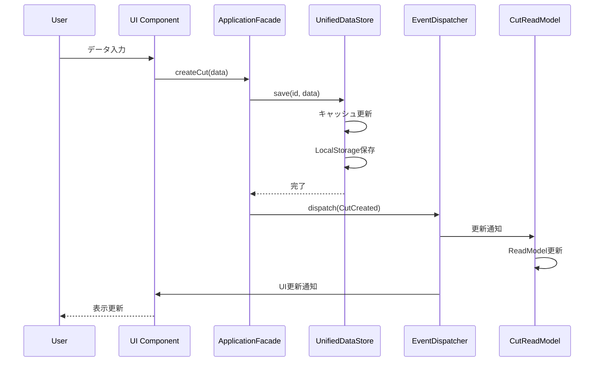

## 3. イベントフロー図

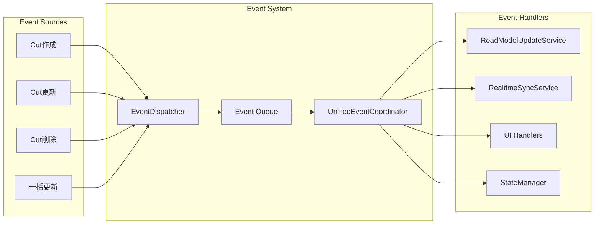

## 4. ServiceContainer依存関係図

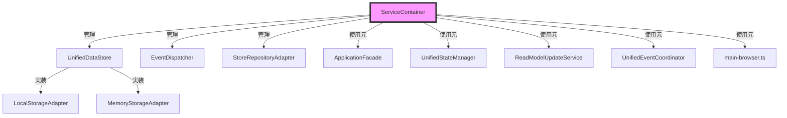

## 5. UI層コンポーネント構造

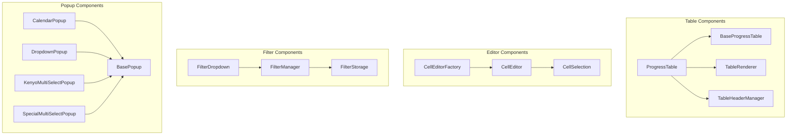

## 6. データストア内部構造

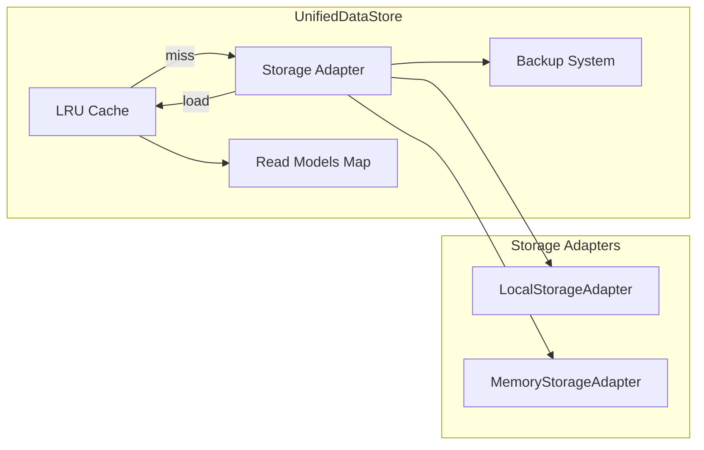

## 7. 状態管理フロー

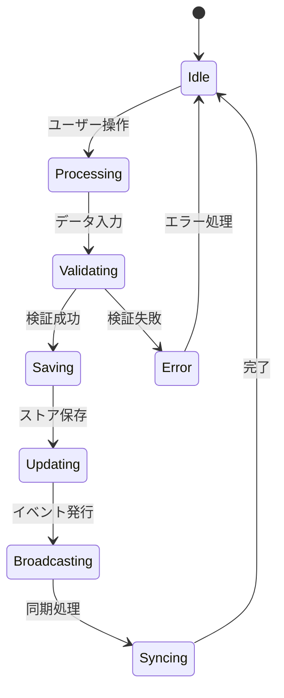

## 8. リファクタリング前後比較

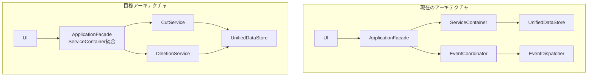

## 9. 主要クラス関係図

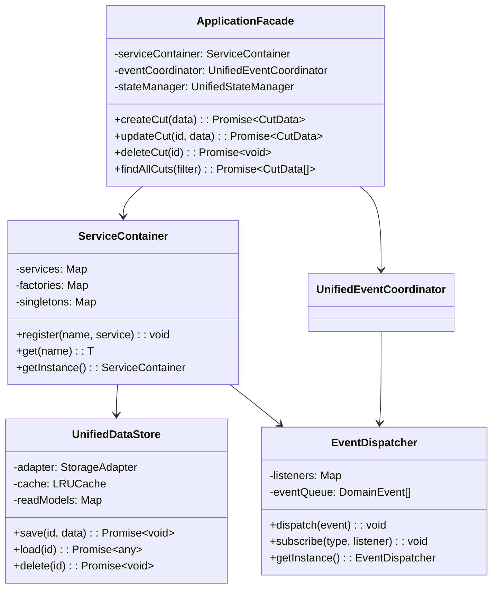

## 10. パフォーマンス最適化ポイント

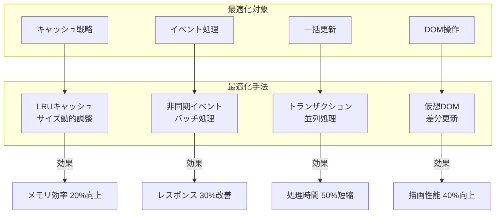

## 11. エラーハンドリングフロー

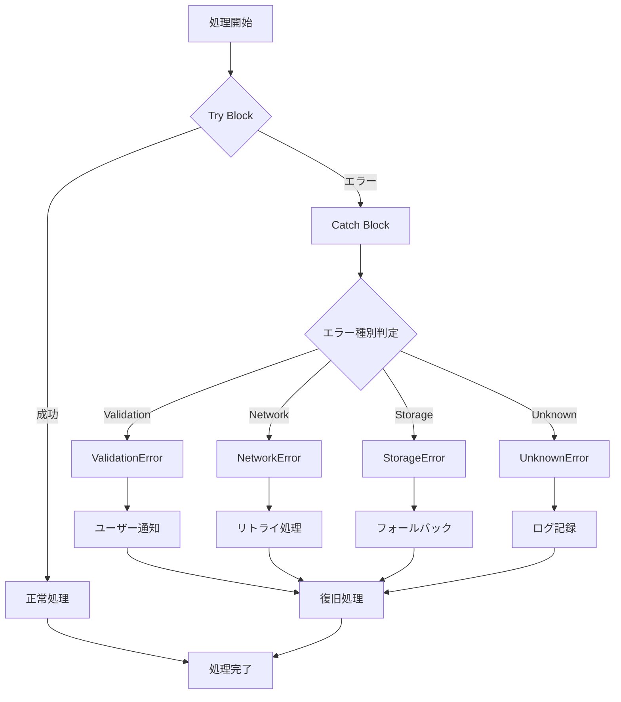

## 12. テスト戦略図

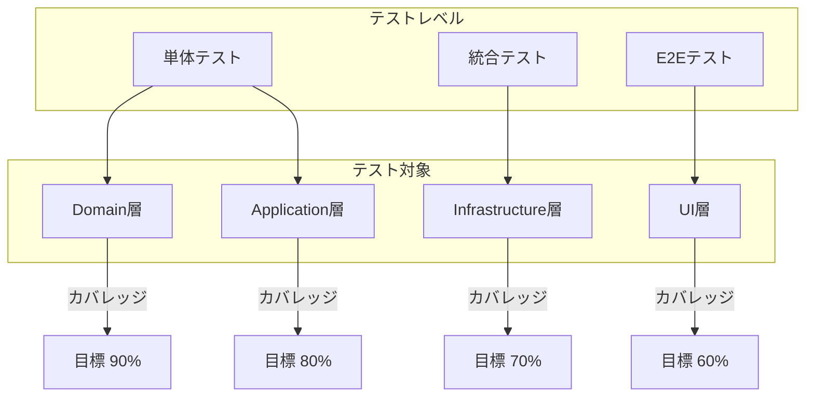

---

これらの図表は、v10.3.3のアーキテクチャを視覚的に表現したものです。
プロジェクトの理解とコミュニケーションにご活用ください。