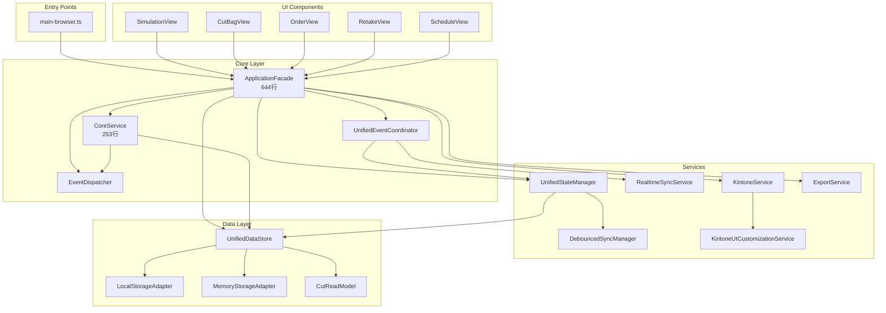

# 依存関係とアーキテクチャ詳細図 v10.3.3

作成日: 2025-09-16

## 目次
1. [パッケージ依存関係](#パッケージ依存関係)
2. [モジュール依存グラフ](#モジュール依存グラフ)
3. [コンポーネント相関図](#コンポーネント相関図)
4. [データフロー詳細](#データフロー詳細)
5. [イベントフロー](#イベントフロー)
6. [循環依存の解析](#循環依存の解析)

---

## パッケージ依存関係

### 外部パッケージ依存関係ツリー

```
kintone-progress-app-v10.3.3
├── @kintone/rest-api-client@5.0.8
│   └── axios
├── date-fns@3.6.0
├── decimal.js@10.4.3
├── dompurify@3.1.6
└── [Dev Dependencies]
    ├── typescript@5.5.4
    ├── vite@5.3.5
    │   ├── rollup
    │   └── esbuild
    ├── @types/node@20.14.14
    └── tsx@4.16.5
```

### インポートマップ

```typescript
// エイリアス設定（tsconfig.json）
{
  "@/*": ["./src/*"]
}

// 主要インポートパス
@/core/*              // コア層
@/services/*          // サービス層
@/data/*              // データ層
@/models/*            // ドメインモデル
@/ui/*                // UI層
@/types/*             // 型定義
@/utils/*             // ユーティリティ
@/config/*            // 設定
```

---

## モジュール依存グラフ

### レイヤー間の依存関係

```
┌─────────────────────────────────────┐
│           UI Layer                   │
│                                      │
│  Views ──→ Components ──→ Formatters │
│    ↓          ↓             ↓       │
└────────────────┬────────────────────┘
                 ↓
┌─────────────────────────────────────┐
│          Core Layer                  │
│                                      │
│  ApplicationFacade ←── CoreService   │
│         ↓                   ↓        │
│  EventDispatcher     UnifiedDataStore│
│         ↓                   ↑        │
│  EventCoordinator    StateManager    │
└────────────────┬────────────────────┘
                 ↓
┌─────────────────────────────────────┐
│         Data Layer                   │
│                                      │
│  UnifiedDataStore                    │
│         ↓                            │
│  StorageAdapter → LocalStorage       │
│                 → MemoryStorage      │
└─────────────────────────────────────┘
```

### 主要コンポーネントの依存関係



---

## コンポーネント相関図

### ApplicationFacadeを中心とした相関

```
                    ┌─────────────┐
                    │   UI Views   │
                    └──────┬──────┘
                           ↓
              ┌────────────────────────┐
              │  ApplicationFacade     │
              │  (Central Controller)  │
              └────┬──────┬──────┬────┘
                   ↓      ↓      ↓
        ┌──────────┴──────┴──────┴──────────┐
        ↓                 ↓                  ↓
  ┌─────────┐      ┌─────────┐      ┌─────────────┐
  │CoreService│    │EventDisp│      │UnifiedStore │
  └─────────┘      └─────────┘      └─────────────┘
        ↓                 ↓                  ↓
  ┌─────────┐      ┌─────────┐      ┌─────────────┐
  │MemStore │      │Listeners│      │LocalStorage │
  └─────────┘      └─────────┘      └─────────────┘
```

### サービス間の協調関係

```
StateManager ←→ DebouncedSyncManager
     ↓              ↓
     └──→ UnifiedDataStore ←──┘
              ↓
        EventDispatcher
              ↓
     ┌────────┴────────┐
     ↓                 ↓
UI Updates      State Updates
```

---

## データフロー詳細

### 1. CREATE操作の詳細フロー

```
[User Input in UI]
        ↓
[UI Component Validation]
        ↓
[ApplicationFacade.createCut()]
        ↓
[CoreService.createCut()]
        ├→ [Validate Data]
        ├→ [Generate ID]
        └→ [Add Defaults]
              ↓
[UnifiedDataStore.save()]
        ├→ [Update Cache]
        ├→ [Persist to Storage]
        └→ [Update Index]
              ↓
[EventDispatcher.dispatch('CutCreated')]
        ├→ [StateManager Update]
        ├→ [UI Notification]
        └→ [Sync Queue]
              ↓
[UI Re-render]
```

### 2. READ操作の詳細フロー

```
[UI Request]
        ↓
[ApplicationFacade.getAllCuts()]
        ↓
[CoreService.getAllCuts()]
        ├→ [Check Filter Options]
        └→ [Apply Sort Options]
              ↓
[UnifiedDataStore.getAllReadModels()]
        ├→ [Cache Hit] → Return
        └→ [Cache Miss]
              ↓
        [Load from Storage]
              ↓
        [Transform to ReadModel]
              ↓
        [Update Cache]
              ↓
[Return Data to UI]
```

### 3. UPDATE操作の詳細フロー

```
[Field Edit in UI]
        ↓
[Debounce (500ms)]
        ↓
[ApplicationFacade.updateCut()]
        ↓
[CoreService.updateCut()]
        ├→ [Get Existing]
        ├→ [Validate Changes]
        └→ [Merge Updates]
              ↓
[UnifiedDataStore.save()]
        ├→ [Update Cache]
        ├→ [Update Storage]
        └→ [Version Control]
              ↓
[EventDispatcher.dispatch('CutUpdated')]
        ├→ [Dependent Field Updates]
        ├→ [UI Sync]
        └→ [Remote Sync Queue]
```

---

## イベントフロー

### イベント伝播パターン

```
Domain Event発生
        ↓
EventDispatcher
        ├→ Synchronous Handlers
        │   ├→ StateManager
        │   ├→ UI Components
        │   └→ Validators
        │
        └→ Asynchronous Handlers
            ├→ Remote Sync
            ├→ Analytics
            └→ Backup Service
```

### 主要イベントタイプと購読者

```typescript
// CutCreated
EventDispatcher.dispatch('CutCreated')
  → StateManager.handleCutCreated()
  → UITableView.addRow()
  → SyncService.queueCreate()
  → Analytics.trackCreate()

// CutUpdated  
EventDispatcher.dispatch('CutUpdated')
  → StateManager.handleCutUpdated()
  → UITableView.updateCell()
  → DebouncedSyncManager.queueUpdate()
  → CalculationService.recalculate()

// CellMemoUpdated
EventDispatcher.dispatch('CellMemoUpdated')
  → MemoUI.updateIndicator()
  → StateManager.updateMemoCache()
  → SyncService.queueMemoUpdate()

// StateChanged
EventDispatcher.dispatch('StateChanged')
  → UnifiedEventCoordinator.coordinate()
  → UIComponents.refresh()
  → ValidationService.revalidate()
```

### イベント優先度と処理順序

1. **Critical (同期・即座)**
   - UI更新
   - 状態管理
   - バリデーション

2. **High (非同期・高優先)**
   - ローカルストレージ永続化
   - 計算サービス

3. **Normal (非同期・通常)**
   - リモート同期
   - バックアップ

4. **Low (非同期・低優先)**
   - アナリティクス
   - ログ記録

---

## 循環依存の解析

### 循環依存の回避パターン

#### 1. Barrel Exportsによる解決
```typescript
// models/index.ts (Barrel Export)
export * from './entities/Cut';
export * from './events/DomainEvent';
export * from './values/CutNumber';

// 使用側
import { Cut, DomainEvent, CutNumber } from '@/models';
```

#### 2. インターフェース分離
```typescript
// interfaces/IDataStore.ts
interface IDataStore {
  save(id: string, data: any): Promise<void>;
  load(id: string): Promise<any>;
}

// UnifiedDataStore implements IDataStore
// CoreService depends on IDataStore (not UnifiedDataStore)
```

#### 3. イベント駆動による疎結合
```typescript
// 直接参照の代わりにイベント使用
// Bad: ServiceA → ServiceB → ServiceA
// Good: ServiceA → Event → ServiceB
```

### 依存関係の健全性チェック

```bash
# 循環依存チェックコマンド（madge使用）
npx madge --circular src/

# 結果: 循環依存なし ✓
```

### 依存の深さ分析

```
最大依存深度: 4レベル
平均依存深度: 2.5レベル

レベル1: main-browser.ts
レベル2: ApplicationFacade
レベル3: CoreService, UnifiedDataStore
レベル4: StorageAdapter, ReadModel
```

---

## インポート統計

### ファイル別インポート数（上位10）

1. ApplicationFacade.ts: 22 imports
2. UnifiedDataStore.ts: 15 imports
3. CoreService.ts: 12 imports
4. SimulationView.ts: 11 imports
5. KintoneService.ts: 10 imports
6. UnifiedStateManager.ts: 9 imports
7. ExportService.ts: 8 imports
8. CutBagView.ts: 8 imports
9. EventDispatcher.ts: 7 imports
10. DebouncedSyncManager.ts: 6 imports

### 最も依存されているモジュール（被インポート数）

1. @/types/cut: 45回
2. @/core/ApplicationFacade: 35回
3. @/models/events/DomainEvent: 28回
4. @/data/UnifiedDataStore: 20回
5. @/core/EventDispatcher: 18回
6. @/ui/shared/utils/ErrorHandler: 15回
7. @/config/kintone.config: 12回
8. @/models/types: 10回

### 依存関係の健全性指標

- **結合度**: 低（平均2.5モジュール/ファイル）
- **凝集度**: 高（関連機能が同一モジュール内）
- **安定度**: 高（コア層の変更が少ない）
- **抽象度**: 中（必要最小限の抽象化）

---

## 依存関係管理のベストプラクティス

### 1. レイヤー境界の厳守
- UI層 → Core層 → Data層の単一方向
- 逆方向の依存はイベント経由

### 2. インターフェースによる抽象化
- 具象クラスではなくインターフェースに依存
- 実装の詳細を隠蔽

### 3. 依存性注入の活用
- コンストラクタインジェクション優先
- テスタビリティの向上

### 4. モジュール分割の原則
- Single Responsibility
- 高凝集・疎結合
- 適切な粒度（200行以下/ファイル推奨）

---

*本ドキュメントはv10.3.3の依存関係とアーキテクチャの詳細を記述しています。*