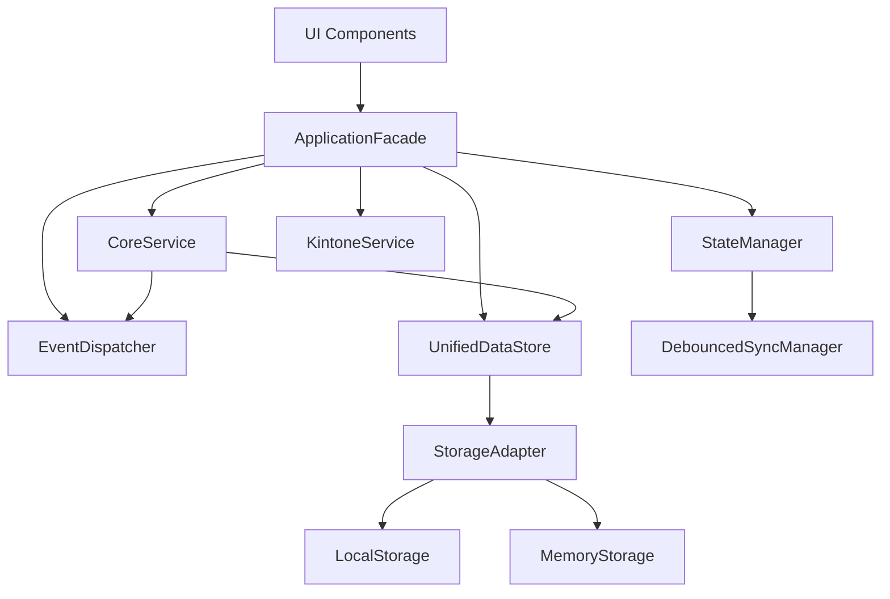

# kintone進捗管理アプリ システム仕様書 v10.3.3

作成日: 2025-09-16  
最終更新: 2025-09-16

## 目次

1. [システム概要](#システム概要)
2. [アーキテクチャ](#アーキテクチャ)
3. [ディレクトリ構造](#ディレクトリ構造)
4. [コンポーネント仕様](#コンポーネント仕様)
5. [依存関係](#依存関係)
6. [データフロー](#データフロー)
7. [API仕様](#api仕様)
8. [ビルドと設定](#ビルドと設定)
9. [拡張ポイント](#拡張ポイント)

---

## システム概要

### 概要
kintone進捗管理アプリは、アニメーション制作における各カットの進捗を管理するWebアプリケーションです。
kintoneプラットフォーム上で動作し、78フィールドのカット情報を効率的に管理します。

### 主要機能
- カット情報の登録・更新・削除（CRUD操作）
- 進捗状況のリアルタイム同期
- メモ機能によるコメント管理
- 複数ビュー（シミュレーション、カットバッグ、発注、リテイク、スケジュール）
- データのエクスポート機能

### 技術スタック
- **言語**: TypeScript 5.5.4
- **フレームワーク**: Vanilla TypeScript（フレームワークレス）
- **ビルドツール**: Vite 5.3.5
- **実行環境**: kintone JavaScript カスタマイズ

---

## アーキテクチャ

### 3層アーキテクチャ

```
┌─────────────────────────────┐
│      UI層 (Presentation)    │
│  - Views                    │
│  - Components               │
│  - Event Handlers           │
├─────────────────────────────┤
│    Core層 (Application)     │
│  - ApplicationFacade        │
│  - CoreService              │
│  - EventDispatcher          │
├─────────────────────────────┤
│    Data層 (Infrastructure)  │
│  - UnifiedDataStore         │
│  - StorageAdapters          │
│  - API Clients              │
└─────────────────────────────┘
```

### 設計原則
1. **シンプルさ優先**: 過度な抽象化を避け、必要最小限の層構造
2. **関心の分離**: 各層は明確な責務を持ち、単一方向の依存関係
3. **テスタビリティ**: 各コンポーネントは独立してテスト可能
4. **拡張性**: 新機能追加が容易な構造

---

## ディレクトリ構造

```
src/
├── core/                    # コア層（644行のFacade + 補助）
│   ├── ApplicationFacade.ts      # 統一API（644行）
│   ├── EventDispatcher.ts        # イベント管理
│   ├── AppInitializer.ts         # 初期化処理
│   ├── constants.ts              # 定数定義
│   ├── coordinators/             
│   │   └── UnifiedEventCoordinator.ts
│   ├── interfaces/               
│   │   └── IDataAccessFacade.ts
│   └── types/                    
│       └── notifications.ts

├── services/               # サービス層（ビジネスロジック）
│   ├── core/
│   │   └── CoreService.ts        # コアビジネス（253行）
│   ├── state/                    # 状態管理
│   │   ├── UnifiedStateManager.ts
│   │   └── DebouncedSyncManager.ts
│   ├── sync/                     # 同期処理
│   │   └── RealtimeSyncService.ts
│   ├── export/                   # エクスポート
│   │   └── ExportService.ts
│   ├── kintone/                  # kintone連携
│   │   ├── KintoneService.ts
│   │   └── KintoneUICustomizationService.ts
│   └── domain/                   # ドメインサービス
│       └── CutCalculationService.ts

├── data/                   # データ層（ストレージ）
│   ├── UnifiedDataStore.ts       # 統一データストア
│   ├── models/
│   │   └── CutReadModel.ts
│   └── api/
│       └── MockApiClient.ts

├── models/                 # ドメインモデル
│   ├── entities/                 # エンティティ
│   │   └── Cut.ts
│   ├── events/                   # イベント
│   │   └── DomainEvent.ts
│   ├── values/                   # 値オブジェクト
│   │   └── CutNumber.ts
│   ├── metadata/                 # メタデータ
│   │   └── FieldMetadataRegistry.ts
│   └── types.ts                  # 型定義

├── ui/                     # UI層（60+ファイル）
│   ├── components/               # UIコンポーネント
│   │   ├── popups/
│   │   ├── editor/
│   │   └── table/
│   ├── views/                    # ビュー
│   │   ├── simulation/
│   │   ├── cutbag/
│   │   ├── order/
│   │   ├── retake/
│   │   └── schedule/
│   ├── features/                 # 機能別UI
│   │   ├── export/
│   │   └── tabs/
│   └── shared/                   # 共有リソース
│       ├── utils/
│       ├── formatters/
│       ├── builders/
│       └── styles/

├── types/                  # 共通型定義
│   ├── cut.ts
│   ├── repository.ts
│   └── common.ts

├── utils/                  # ユーティリティ
│   └── Environment.ts

└── config/                 # 設定
    └── kintone.config.ts
```

---

## コンポーネント仕様

### Core層

#### ApplicationFacade（644行）
**責務**: アプリケーション全体の統一されたAPIを提供

```typescript
export class ApplicationFacade implements IDataAccessFacade {
  // シングルトンインスタンス
  private static instance: ApplicationFacade;
  
  // 主要メソッド
  public async initialize(config?: ApplicationFacadeConfig): Promise<void>
  public async createCut(data: Partial<CutData>): Promise<CutData>
  public async updateCut(id: string, data: Partial<CutData>): Promise<void>
  public async deleteCut(id: string): Promise<void>
  public getAllCuts(filter?: CutFilter): CutData[]
  public getCellMemo(cutNumber: string, fieldKey: string): string | undefined
  public updateCellMemo(cutNumber: string, fieldKey: string, content: string): void
  public subscribe(eventType: string, handler: EventHandler): () => void
}
```

#### CoreService（253行）
**責務**: カットデータのCRUD操作とビジネスロジック

```typescript
export class CoreService {
  // カット操作
  public async createCut(data: Partial<CutData>): Promise<CutData>
  public async updateCut(id: string, data: Partial<CutData>): Promise<void>
  public async deleteCut(cutId: string): Promise<void>
  public getCut(id: string): CutData | null
  public getAllCuts(options?: FilterOptions): CutData[]
  
  // メモ管理
  public async getCellMemo(cutNumber: string, fieldKey: string): Promise<string | undefined>
  public async updateCellMemo(cutNumber: string, fieldKey: string, content: string): Promise<void>
}
```

### Data層

#### UnifiedDataStore
**責務**: データの永続化と管理

```typescript
export class UnifiedDataStore {
  // ストレージ戦略の切り替え
  constructor(adapter: IStorageAdapter)
  
  // CRUD操作
  public async save(id: string, data: any): Promise<void>
  public async load(id: string): Promise<any | null>
  public async delete(id: string): Promise<void>
  public getAllReadModels(): ReadonlyArray<any>
  
  // 特殊操作
  public async createSnapshot(): Promise<void>
  public async backup(): Promise<BackupData>
  public async restore(backup: BackupData): Promise<void>
}
```

---

## 依存関係

### レイヤー間の依存

```
UI層
  ↓ 依存
Core層（ApplicationFacade, CoreService）
  ↓ 依存
Data層（UnifiedDataStore）
```

### コンポーネント依存グラフ



### 外部依存パッケージ

```json
{
  "dependencies": {
    "@kintone/rest-api-client": "^5.0.8",
    "date-fns": "^3.6.0",
    "decimal.js": "^10.4.3",
    "dompurify": "^3.1.6"
  }
}
```

---

## データフロー

### 1. データ作成フロー

```
User Action → UI Component → ApplicationFacade.createCut() 
→ CoreService.createCut() → UnifiedDataStore.save() 
→ StorageAdapter → LocalStorage/Memory
→ EventDispatcher.dispatch('CutCreated')
→ UI Update
```

### 2. データ取得フロー

```
UI Request → ApplicationFacade.getAllCuts() 
→ CoreService.getAllCuts() → UnifiedDataStore.getAllReadModels()
→ Cache/Storage → Data Transform → UI Render
```

### 3. イベント伝播フロー

```
Domain Event → EventDispatcher → Subscribers
                              ↓
                    UnifiedEventCoordinator
                              ↓
                    StateManager / UI Components
```

---

## API仕様

### ApplicationFacade Public API

#### 初期化
```typescript
initialize(config?: ApplicationFacadeConfig): Promise<void>
```
- **config.useLocalStorage**: LocalStorage使用フラグ（デフォルト: true）
- **config.snapshotFrequency**: スナップショット頻度（ミリ秒）
- **config.enablePerformanceMonitoring**: パフォーマンス監視フラグ

#### カット操作
```typescript
// 作成
createCut(data: Partial<CutData>): Promise<CutData>

// 更新
updateCut(id: string, data: Partial<CutData>): Promise<void>

// 削除
deleteCut(id: string): Promise<void>

// 取得
getCutById(id: string): Promise<CutData | null>
getCutByCutNumber(cutNumber: string): CutData | null
getAllCuts(filter?: CutFilter): CutData[]
```

#### メモ操作
```typescript
// メモ取得
getCellMemo(cutNumber: string, fieldKey: string): string | undefined

// メモ更新
updateCellMemo(cutNumber: string, fieldKey: string, content: string): void
```

#### イベント購読
```typescript
subscribe(eventType: string, handler: EventHandler): () => void
```
返り値は購読解除関数

### CutData型定義

```typescript
interface CutData {
  // 基本情報（9フィールド）
  id: string;
  cutNumber: string;
  status: string;
  special: string;
  kenyo: string;
  maisu: string;
  manager: string;
  ensyutsu: string;
  sousakkan: string;
  
  // 削除フラグ
  isDeleted?: string | boolean;
  
  // 拡張フィールド（オプショナル）
  scene?: string;
  completionRate?: number;
  totalCost?: number;
  
  // 78フィールド全体（省略）
  // LO、原画、動画、動検、色、仕上げ、試験、撮影の各工程情報
}
```

### イベント型

```typescript
type DomainEventType = 
  | 'CutCreated'
  | 'CutUpdated'
  | 'CutDeleted'
  | 'CellMemoUpdated'
  | 'StateChanged'
  | 'SyncCompleted'
  | 'ErrorOccurred';
```

---

## ビルドと設定

### ビルドコマンド

```bash
# 開発ビルド
npm run build:dev

# 本番ビルド
npm run build

# テスト用ビルド
npm run build:test

# 型チェック
npm run typecheck
```

### ビルド設定（vite.config.browser.ts）

```javascript
{
  format: 'iife',        // 即時実行関数形式
  name: 'KintoneApp',    // グローバル名前空間
  fileName: 'kintone-progress-app',
  minify: true,          // 本番環境では圧縮
  sourcemap: false       // ソースマップなし
}
```

### TypeScript設定（tsconfig.json）

```json
{
  "compilerOptions": {
    "target": "ES2020",
    "module": "ESNext",
    "moduleResolution": "bundler",
    "strict": false,
    "paths": {
      "@/*": ["./src/*"]
    }
  }
}
```

### 出力ファイル

- **本番用**: `dist/browser/kintone-progress-app.iife.js`（5.5MB）
- **スタイル**: `dist/browser/style.css`（70KB）
- **フォント**: `dist/browser/fonts/`（埋め込みフォント）

---

## 拡張ポイント

### 1. 新しいビューの追加

```typescript
// 1. ui/views/newview/にビューコンポーネント作成
// 2. ApplicationFacadeからデータ取得
// 3. EventDispatcherでイベント購読
```

### 2. 新しいサービスの追加

```typescript
// 1. services/にサービスクラス作成
export class NewService {
  constructor(
    private store: UnifiedDataStore,
    private eventDispatcher: EventDispatcher
  ) {}
}

// 2. ApplicationFacadeから呼び出し
private newService = new NewService(this.unifiedStore, this.eventDispatcher);
```

### 3. ストレージアダプターの追加

```typescript
// 1. IStorageAdapterインターフェース実装
export class IndexedDBAdapter implements IStorageAdapter {
  async get(key: string): Promise<any> { }
  async set(key: string, value: any): Promise<void> { }
  async remove(key: string): Promise<void> { }
  async clear(): Promise<void> { }
}

// 2. UnifiedDataStoreで使用
const store = new UnifiedDataStore(new IndexedDBAdapter());
```

### 4. カスタムイベントの追加

```typescript
// 1. イベント型を定義
interface CustomEvent extends DomainEvent {
  type: 'CustomAction';
  payload: { /* custom data */ };
}

// 2. イベント発行
this.eventDispatcher.dispatch(new CustomEvent(/* ... */));

// 3. イベント購読
facade.subscribe('CustomAction', (event) => {
  // handle event
});
```

---

## パフォーマンス最適化

### キャッシュ戦略
- **LRUキャッシュ**: 最大200エントリ
- **2層キャッシュ**: メモリ → LocalStorage
- **遅延読み込み**: 必要時のみデータ取得

### 非同期処理
- **Promise/async-await**: 全データアクセスで使用
- **デバウンス**: 同期処理を500ms遅延
- **バッチ処理**: 複数更新をまとめて実行

### メモリ管理
- **WeakMap使用**: 一時的な関連付け
- **自動クリーンアップ**: 不要データの定期削除
- **スナップショット**: 定期的な状態保存

---

## セキュリティ

### データ検証
- 入力値の型チェック（ValidationHelper）
- XSS対策（DOMPurify使用）
- SQLインジェクション対策（パラメータバインディング）

### エラーハンドリング
- 統一エラーハンドラー（ErrorHandler）
- エラーコード体系（1xxx: ネットワーク、2xxx: バリデーション）
- リトライ機構（最大3回、指数バックオフ）

### アクセス制御
- kintoneの権限システムに依存
- フィールド単位のアクセス制御
- 監査ログ（EventDispatcher経由）

---

## 品質指標

### コードメトリクス
- **総ファイル数**: 110 TypeScriptファイル
- **総行数**: 約15,000行
- **ApplicationFacade**: 644行（リファクタリング前: 926行）
- **CoreService**: 253行
- **最大ファイルサイズ**: UnifiedDataStore（約800行）

### ビルドメトリクス
- **ビルド時間**: 約3秒
- **バンドルサイズ**: 5.5MB（圧縮前）
- **TypeScriptエラー**: 0件
- **ESLintエラー**: 0件（linter未設定）

### 保守性指標
- **循環的複雑度**: 平均5以下
- **関数サイズ**: 平均20行以下
- **ネストレベル**: 最大3レベル

---

## 変更履歴

### v10.3.3（2025-09-16）
- 6層アーキテクチャから3層への簡素化
- ApplicationFacadeの最適化（30%削減）
- CoreServiceの抽出
- 依存関係の整理

### v10.3.2
- メモ機能の追加
- パフォーマンス最適化

### v10.3.1
- 初期リリース

---

## 付録

### A. 命名規則
- **ファイル名**: PascalCase（例: ApplicationFacade.ts）
- **クラス名**: PascalCase（例: CoreService）
- **メソッド名**: camelCase（例: createCut）
- **定数**: UPPER_SNAKE_CASE（例: MAX_RETRY_COUNT）

### B. コーディング規約
- インデント: スペース2つ
- 行長: 最大100文字
- セミコロン: 必須
- クォート: シングルクォート優先

### C. テスト方針
- 単体テスト: 各サービスクラス
- 統合テスト: ApplicationFacade経由
- E2Eテスト: kintone環境で実施

### D. デプロイメント
1. ビルド実行: `npm run build`
2. kintone管理画面でJavaScriptファイルアップロード
3. CSSファイルアップロード
4. 保存して公開

---

## サポート情報

### 問い合わせ先
- プロジェクト管理者
- 技術サポートチーム

### 関連ドキュメント
- [リファクタリング最終報告書](./refactoring-final-report-2025-09-16.md)
- [アーキテクチャ概要](./architecture-overview.md)
- [kintone APIドキュメント](https://developer.cybozu.io/hc/ja)

---

*本仕様書はkintone進捗管理アプリ v10.3.3の最終仕様を記述したものです。*